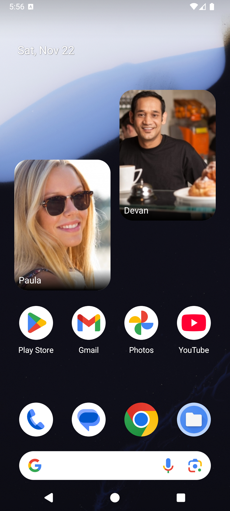
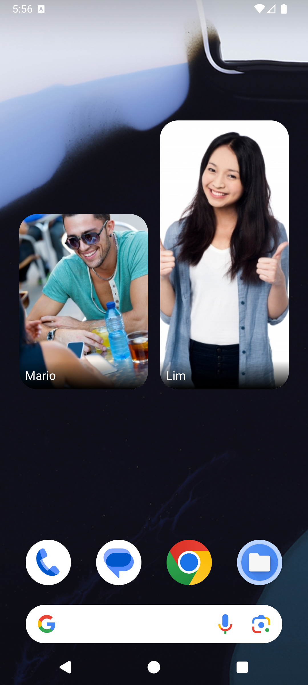
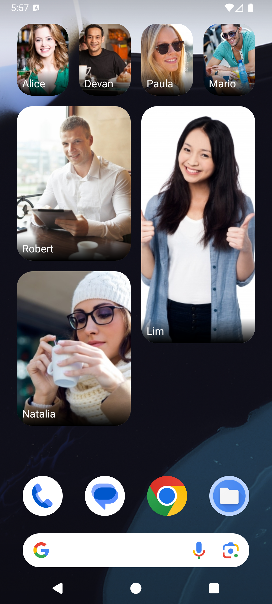
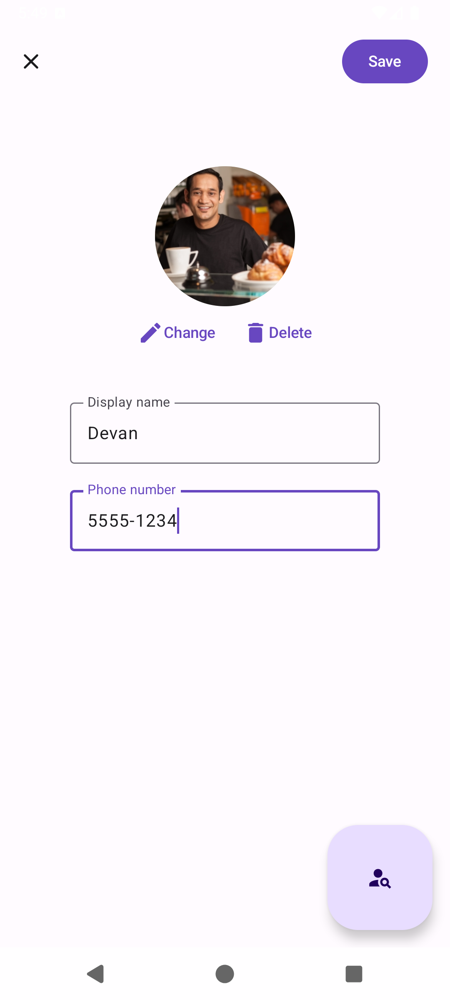

# Direct Call Widget

Direct Call Widget is an Android app that makes calling favourite contacts quicker and more accessible. It adds contact widgets to the home screen so a call can be started by tapping a contact's picture instead of navigating a phonebook.

It is especially intended for people with visual impairments or limited reading ability. Widgets can be resized to make contacts easier to recognize and select.

> [!IMPORTANT]
> This project began in 2014 and is currently undergoing a major refactor. Contributors should wait for the next major version, likely 2.0, before opening a pull request.

## Features

- Create home-screen widgets for individual contacts.
- Choose a contact picture from the device photo picker.
- Resize widgets to suit the user's needs.
- Place several contact widgets on the same home screen.
- Start a phone call directly from a widget.
- Available in English and Spanish.

The app requires access to contacts to select recipients and permission to place calls when a widget is tapped.

## Screenshots

<p>
  
  
  
  
</p>

## Download

Direct Call Widget is free and contains no ads. It is available on [Google Play](https://play.google.com/store/apps/details?id=com.blaxsoftware.directcallwidget).

<a href="https://play.google.com/store/apps/details?id=com.blaxsoftware.directcallwidget">
  
</a>

## Requirements

- Android Studio with an Android SDK that includes API 36.
- JDK 17 or newer.
- A device or emulator running Android 6.0 (API 23) or newer.

## Build and test

The project uses the Gradle wrapper, so a separate Gradle installation is not required.

```sh
./gradlew assembleCollectionDisabledDebug
./gradlew build
```

The generated debug APK is located under `app/build/outputs/apk/collectionDisabled/debug/`. `build` compiles the project and runs its checks. The `collectionDisabled` variant disables analytics collection; use `assembleCollectionEnabledDebug` to build the analytics-enabled variant.

## Project structure

The project is organized as a modular Android application:

| Area | Modules | Responsibility |
| --- | --- | --- |
| Application | `:app` | Application entry point, widget providers, navigation and legacy UI. |
| Features | `:feature:onecontactwidget`, `:feature:settings` | Contact-widget configuration and app settings. |
| Shared UI | `:shared:contactconfig`, `:core:ui` | Reusable contact configuration and UI/theme components. |
| Domain | `:core:domain` | Domain models, repository contracts and use cases. |
| Data | `:data:devicecontact`, `:data:onecontactwidget`, `:data:picture` | Contacts provider, widget preferences and picture storage. |
| Platform services | `:core:di`, `:core:preferences-user`, `:core:analytics` | Dependency injection, user preferences and optional analytics. |

The newer modules follow a layered design: features use domain use cases, domain depends on repository contracts, and data modules provide their implementations. Hilt supplies dependencies between modules. The app module also contains legacy widget implementations that are being migrated as part of the refactor.

## Useful references

- [Android developer documentation](https://developer.android.com/)
- [Android Architecture Samples](https://github.com/android/architecture-samples)
- [Now in Android](https://github.com/android/nowinandroid)

## Contributing

Please open an issue to report a bug or propose an improvement. New contributors can look for issues labelled [`good first issue`](https://github.com/fpalonso/direct-call-widget/labels/good%20first%20issue).

Because of the ongoing refactor, please coordinate before starting a pull request.

## License

Direct Call Widget is distributed under the [GNU General Public License v3.0](COPYING).

Google Play and the Google Play logo are trademarks of Google LLC.
